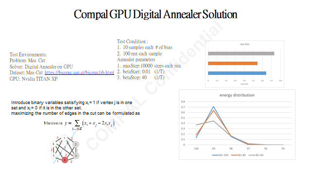

# Requirements
OS requirement : 
1. Ubuntu == 20.04
2. Nvidia Driver Version == 495.29.05
3. CUDA versuib == 11.5

Python Env requirement :
1. python == 3.9
2. pyqubo == 1.2.0
3. numpy == 1.23.3
4. tqdm == 4.64.1

# Build Project
1. Make sure your host env as same as OS requirement
2. Download Dockerfile
3. Build Docker Image
   ```
   sudo docker build -t gpuda . --no-cache
   ```
4. Docker Run gpuda
   ```
   sudo docker run -it -p 8080:22 --gpus all gpuda bash
   ```
# Run MaxCut sample on Docker
reference paper http://people.brunel.ac.uk/~mastjjb/jeb/bqp.pdf
1. go to gpu_kernel sub directory 
   ```
   cd ./gpu_kernel
   ```
2. Run maxcut sample to solve Maxcut test data located at ./data/g05
   ```
   python maxcut_sample.py
   ```
3. Check output file "g05hist10000.txt" 10000 denotes it runs 10000 iterations and it will execute 100 runs for each test file then generate report in one line summary.
The summary line include 'test_file_name   0.xxxx  [0.yy ...]' , xxxx is average rnu time(in seconeds), yy is percentage which is i% closed to solution(i is arrary index, 0 means DA find exact answer or event better as solution and 1 means there is 1% delta)

